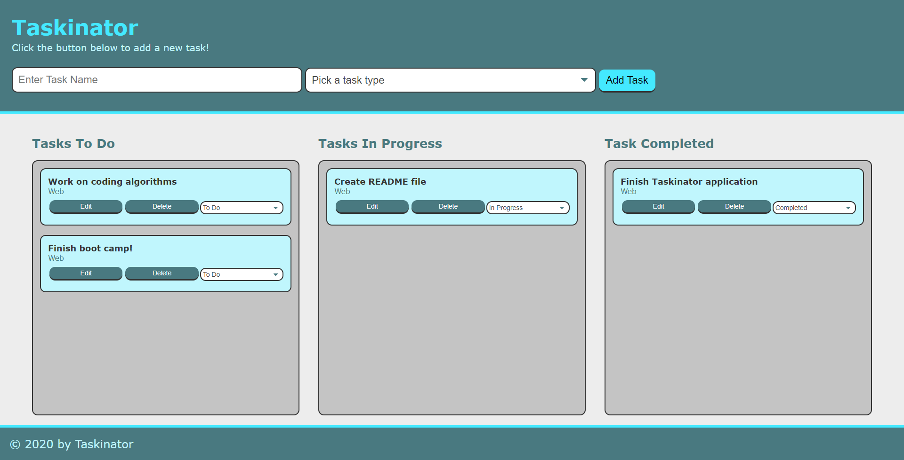

# Taskinator
## Purpose
A simple Kanban-style task management application.

## Contents
1. [Features](#features)
2. [Deployed Page](#deployed-page)
3. [Contributions](#contributions)

## Features
* Users can add new tasks and select a task type from the top of the application.
* Tasks are added to the "To Do" list.
* Tasks can be edited or removed completely.
* Users can update the status of their task to "In Progress" or "Task Completed" either through the select menu or by drag-and-drop.
* Tasks are saved in the user's local storage and will reload upon refreshing the page.
* Application is media query responsive.

## Deployed Page

[Taskinator Deployed Page](https://deckiedevs.github.io/taskinator)

## Contributions
* Basic HTML structure and CSS provided as a starter code by UCF Coding Boot Camp.
* Web page functionality coded with much interest by Mila Decker.